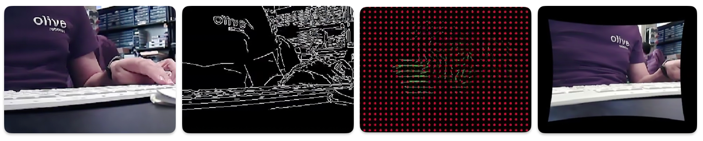
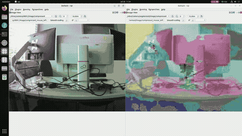
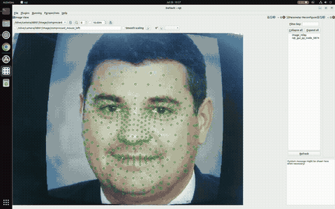
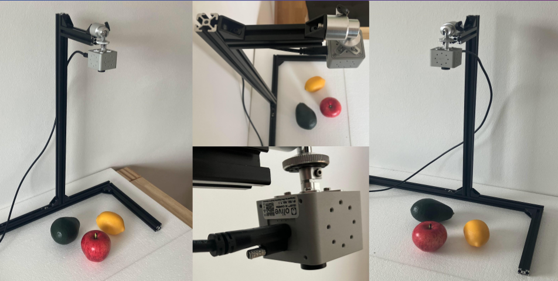

# 📸 olvx_playground_camera
A straightforward ROS 2 package written in Python, featuring multiple nodes to facilitate working with the Olive Camera, enhanced with TPU acceleration.

The camera uses the default internal calibration file. If you want to recalibrate your camera, please follow the steps outlined in the documentation.

https://olive-robotics.com/docs2/olixvision-camera/#camera-calibration

## Supported Embedded Libraries for the Olive AI Camera

| Coral                           | OpenCV                               | ROS 2                         | Python 3                         |
|---------------------------------|--------------------------------------|-------------------------------|----------------------------------|
|  |  |  |  |

## Table of Contents
<!-- TOC -->
* [📸 olvx_playground_camera](#-olvx_playground_camera)
  * [Supported Embedded Libraries for the Olive AI Camera](#supported-embedded-libraries-for-the-olive-ai-camera)
  * [Table of Contents](#table-of-contents)
  * [Installation](#installation)
  * [🚀 Apps](#-apps-)
    * [0️⃣ Hello World App (TPU Embedded App)](#0-hello-world-app-tpu-embedded-app)
    * [1️⃣ Object Recognition (TPU Embedded App)](#1-object-recognition-tpu-embedded-app)
      * [📋 Object List](#-object-list)
    * [2️⃣ Skeleton Detection (TPU Embedded App)](#2-skeleton-detection-tpu-embedded-app)
      * [🚶‍♂️ Body Point List](#-body-point-list)
    * [3️⃣ Gesture Recognition (TPU Embedded App)](#3-gesture-recognition-tpu-embedded-app)
      * [📡 ROS2 Topic](#-ros2-topic)
      * [🤏 Gestures](#-gestures)
    * [4️⃣ April Tag Detection (CPU Embedded App)](#4-april-tag-detection-cpu-embedded-app)
      * [Method 1: Manual](#method-1-manual-)
      * [Method 2: Preinstalled (patch > 1214)](#method-2-preinstalled-patch--1214-)
    * [5️⃣ OpenCV Examples (Edge Dector, Optical Flow, Rectify, IMShow) (Host Computer App)](#5-opencv-examples-edge-dector-optical-flow-rectify-imshow-host-computer-app)
    * [6️⃣ Monocular Depth Estimation (Host Computer App)](#6-monocular-depth-estimation-host-computer-app)
    * [7️⃣ Semantic Segmentation](#7-semantic-segmentation)
    * [8️⃣ Facial Landmark Detection](#8-facial-landmark-detection)
    * [9️⃣ Fruit Recognition](#9-fruit-recognition)
<!-- TOC -->

## Installation

```commandline
git clone --recurse-submodules git@github.com:olive-robotics/olvx_playground_camera.git
```

This command will ensure that you fetch all examples.

Each project has its own set of dependencies. To run a project, first navigate into its folder, and run:
```commandline
pip install -r requirements.txt
```


## 🚀 Apps 

### 0️⃣ Hello World App (TPU Embedded App)

This example is a simple parrot detector which you can test the hardware and make sure the Coral TPU is enabled. 

Sample output:

```
Olive TPU Hello World v0.1
step1
step2
step3
step4
Ara macao (Scarlet Macaw): 0.75781
```

### 1️⃣ Object Recognition (TPU Embedded App)
This example demonstrates object detection utilizing a ROS2 image topic and encases each detected object within a square.


```
cd examples/01-ObjectDetection/src
python3 app_node_object_detection.py
```

#### 📋 Object List
person, bicycle, car, motorcycle, airplane, bus, train, truck, boat, traffic light, fire hydrant, stop sign, parking meter, bench, bird, cat, dog, horse, sheep, cow, elephant, bear, zebra, giraffe, backpack, umbrella, handbag, tie, suitcase, frisbee, skis, snowboard, sports ball, kite, baseball bat, baseball glove, skateboard, surfboard, tennis racket, bottle, wine glass, cup, fork, knife, spoon, bowl, banana, apple, sandwich, orange, broccoli, carrot, hot dog, pizza, donut, cake, chair, couch, potted plant, bed, dining table, toilet, tv, laptop, mouse, remote, keyboard, cell phone, microwave, oven, toaster, sink, refrigerator, book, clock, vase, scissors, teddy bear, hair drier, toothbrush.

🔗 **More Information**: [ObjectDetection.md](examples/01-ObjectDetection/README.md)

### 2️⃣ Skeleton Detection (TPU Embedded App)
Explore the utilization of the PoseNet model to detect human poses from a ROS2 image topic, pinpointing the location of body parts like elbows, shoulders, or feet.


```
cd examples/02-SkeletonDetection/src
python3 app_node_skeleton_posenet.py
```

#### 🚶‍♂️ Body Point List
nose, leftEye, rightEye, leftEar, rightEar, leftShoulder, rightShoulder, leftElbow, rightElbow, leftWrist, rightWrist, leftHip, rightHip, leftKnee, rightKnee, leftAnkle, rightAnkle.

🔗 **More Information**: [SkeletonDetection.md](examples/02-SkeletonDetection/README.md)

### 3️⃣ Gesture Recognition (TPU Embedded App)
An example showcasing the use of an MLP neural network model to train gesture classes.


#### 📡 ROS2 Topic
The detection results will be published on the topic `/gesturerecognition`. Utilize `ros2 topic list` or `ros2 topic echo /gesturerecognition` to check whether a message is published, verifying the device’s operational status.

#### 🤏 Gestures
Both hands down, both hands up, left down / right up, right down / left up, left down / right side, right down / left side, hands on hip.

🔗 **More Information**: [GestureRecognition.md](examples/03-GestureRecognition/README.md)

### 4️⃣ April Tag Detection (CPU Embedded App)

#### Method 1: Manual 


Example forked from:
https://github.com/ros-misc-utilities/apriltag_detector

A4 Tag Dataset:
https://github.com/rgov/apriltag-pdfs

Download the OpenCV-4 Compiled for Olive Camera
[Download](https://drive.google.com/file/d/1AaO6qKZIV1wDaI-2pzJ3npGFW7vGyhDP/view?usp=sharing)

Place the folder in the home and follow this namings:

```
/home/olive/opencv_install/opencv-4.x/
```

Update the .bashrc and add this lines to it:

```
source /opt/olive/script/env.sh
export PATH="/home/olive/.local/bin:$PATH"
export LD_LIBRARY_PATH=$LD_LIBRARY_PATH:/home/olive/opencv_install/opencv-4.x/build/lib
export LD_LIBRARY_PATH=$LD_LIBRARY_PATH:/opt/olive/lib
export OpenCV_DIR=/home/olive/opencv_install/opencv-4.x/build
export PYTHONPATH=~/opencv_install/opencv-4.x/build/lib/python3:$PYTHONPATH
```

Then install the AprilTag 3 library from examples/04-AprilTag/lib/apriltag

```
rm -r build
cmake -B build -DCMAKE_BUILD_TYPE=Release
sudo cmake --build build --target install
```

Then build the ROS2 project from examples/04-AprilTag/lib/workspace. You can skip also building if you don't want to change the code.

```
source install/setup.bash
colcon build
```

Then run it with:

```
ros2 launch apriltag_detector node.launch.py
```

#### Method 2: Preinstalled (patch > 1214) 

In the recent software update, the April tag detector is preinstalled in the system, and you can auto-run it by uncommenting the line in olive-app-loader.sh

```
cd /usr/bin
nano olive-app-loader.sh
```

uncomment the last line

```
# ros2 launch apriltag_detector node.launch.py
```
to

```
ros2 launch apriltag_detector node.launch.py
```

To apply the result and run the node without rebooting,

```
sudo systemctl restart olive-app-loader.service
```

### 5️⃣ OpenCV Examples (Edge Dector, Optical Flow, Rectify, IMShow) (Host Computer App)

Run this example on your host computer. Compatible with CPU and GPU.

```
cd examples/05-OpenCV
python3 edge_detector.py
python3 optical_flow.py
```



### 6️⃣ Monocular Depth Estimation (Host Computer App)

Run this example on your host computer. Compatible with CPU and GPU.

```
cd examples/06-DepthEstimation
python3 depth_estimation.py
```


### 7️⃣ Semantic Segmentation

This example runs a semantic segmentation model to generate image masks of what the camera can see.



For more information: please check out the [README](examples/07-SemanticSegmentation/README.md)

### 8️⃣ Facial Landmark Detection

An example showing the MediaPipe facial landmark system, running using an Olive camera.

```commandline
python3 src/app_facial_recognition.py
```



### 9️⃣ Fruit Recognition

This project was developed in coordination with [EkumenLabs](https://github.com/ekumenlabs).

Navigate to this [README](examples/09-FruitDetection/fruit_detection/README.md) to learn more.



