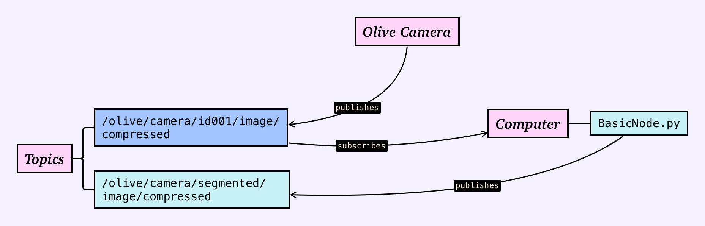

# Image Segmentation


Run on Jetson Orin NX

## Table of Contents
<!-- TOC -->
* [Image Segmentation](#image-segmentation)
  * [Table of Contents](#table-of-contents)
  * [Installation](#installation)
    * [Set up a Virtual Environment](#set-up-a-virtual-environment)
    * [Install Python Packages](#install-python-packages)
    * [Model Download](#model-download)
  * [Running](#running)
<!-- TOC -->

This package contains the code for running image segmentation.

**Segmentation Model**

This project uses the Segformer-B0 model from the Hugging Face Transformers library. Segformer is a lightweight and high-performing transformer-based model for semantic segmentation, developed by NVIDIA.

We chose the B0 variant due to its balance between speed and segmentation quality — especially suitable for real-time inference on CPUs or resource-constrained devices.

Model reference: nvidia/segformer-b0-finetuned-ade-512-512

You can swap out the model for larger versions (e.g., B2, B4, B5) by modifying the Segmenter.py class, but note that performance will vary significantly.


## Installation

This assumes that you have ROS 2 installed on your system.

The code has been validated on ROS 2 Humble, but should work for other versions with minimal changes.

As a part of your ROS 2 installation, you should have `rclpy` installed.
If it's not installed, you may need to check that your ROS 2 installation was correct.

### Set up a Virtual Environment
```commandline
# Install if you don't have venv already
sudo apt update

# Create virtual environment
sudo apt install python3-venv
python3 -m venv venv

# Activate virtual environment
source venv/bin/activate
```


### Install Python Packages
```commandline
pip install -r requirements.txt
```

### Model Download

When you run the program for the first time, it will download the models necessary to run the image segmentation. For
future runs, the program will use the downloaded model and run much faster.

## Running


This requires that ROS 2 is installed on your system.

Configure the `INPUT_TOPIC` and `OUTPUT_TOPIC` in the `BasicNode.py` file to meet your needs.

To get started, simply run:
```commandline
python -m segmentation.BasicNode
```

**Command-Line Options**

| Flag(s)               | Type     | Description                                                                 |
|-----------------------|----------|-----------------------------------------------------------------------------|
| `-b`, `--benchmark`   | `str`    | Enable benchmarking mode                                                    |
| `-c`, `--cores`       | `bool`   | (Benchmarking mode flag required for this) Enable benchmarking across cores |
| `-f`, `--fps`         | `bool`   | Enable FPS tracking mode                                                    |